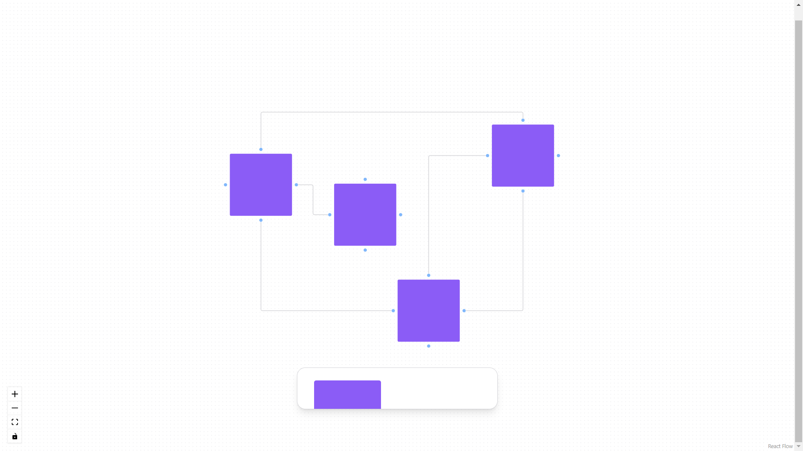

<h1 align="center">Clone do  Figma Jam</h1>

Clone do Figma Jam é uma réplica real do app Figma Jam  

 

  

## 🚀 Tecnologias

Esse projeto foi desenvolvido com as seguintes tecnologias:

- Typescript
- React 
- Radix
- React Flow
- Tailwind CSS
- Git e Github
- Vite

## 💻 Projeto

Figma Jam servir como um grande painel de planejamento e trabalho, em que você pode colocar vários tipos de mídia, post-its, textos, adesivos, além de conter diversos templates prontos para trabalhar com uma infinidade de metodologias e métodos...

- [Visite o projeto online](https://figma-ui-ten.vercel.app/)
